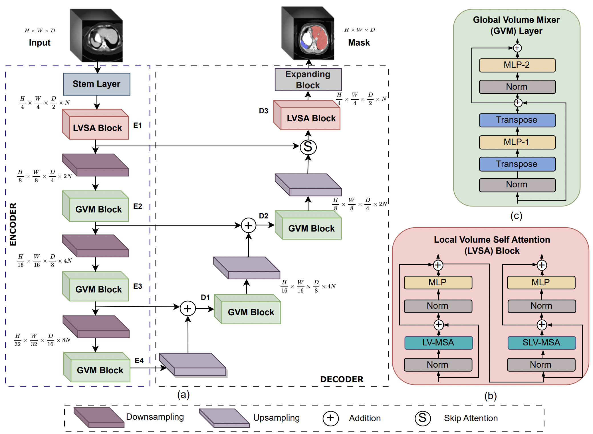
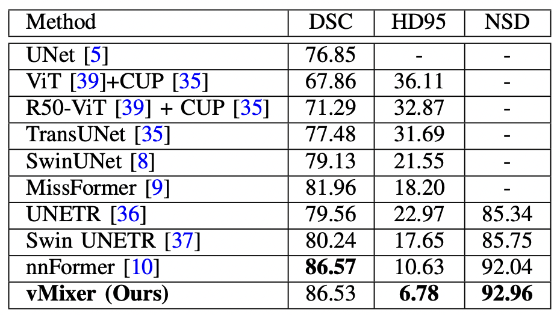
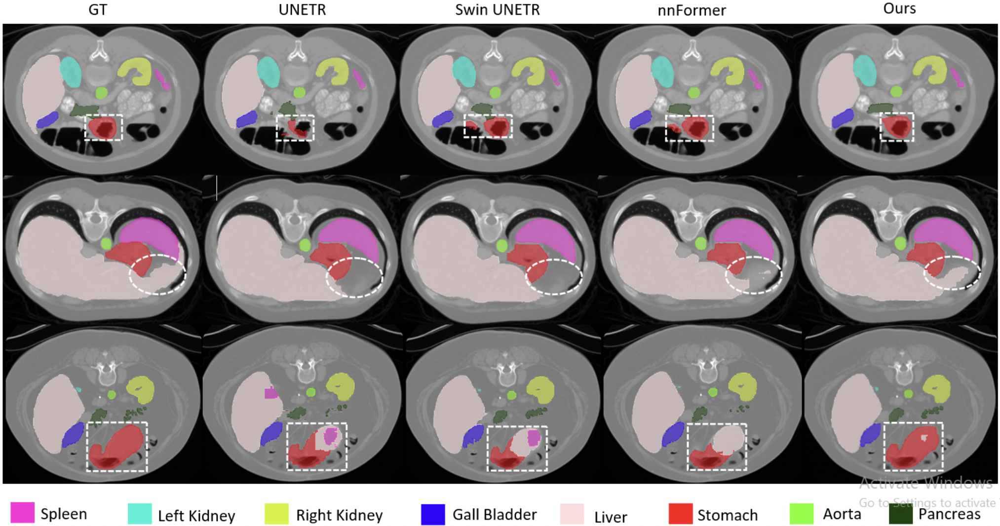

# Improving 3D Medical Image Segmentation at Boundary Regions using Local Self-attention and Global Volume Mixing

Daniya Najiha Abdul Kareem<sup>1</sup>, Mustansar Fiaz<sup>1</sup>, Noa Novershtern<sup>2</sup>, Jacob Hanna<sup>2</sup>, Hisham Cholakkal<sup>1</sup>

Mohamed Bin Zayed University of Artificial Intelligence<sup>1</sup>, Weizmann Institute of Science<sup>2</sup>

[](https://arxiv.org/abs/2410.15360)

<hr />
<p align="center">
  
</p>

> **Abstract:** *Volumetric medical image segmentation is a fundamental problem in medical image analysis where the objective is to accurately classify a given 3D volumetric medical image with voxel-level precision. In this work, we propose a novel hierarchical encoder-decoder-based framework that strives to explicitly capture the local and global dependencies for volumetric 3D medical image segmentation. The proposed framework exploits local volume-based self-attention to encode the local dependencies at high resolution and introduces a novel volumetric MLP-mixer to capture the global dependencies at low-resolution feature representations, respectively. The proposed volumetric MLP-mixer learns better associations among volumetric feature representations. These explicit local and global feature representations contribute to better learning of the shape-boundary characteristics of the organs. Extensive experiments on three different datasets reveal that the proposed method achieves favorable performance compared to state-of-the-art approaches. On the challenging Synapse Multi-organ dataset, the proposed method achieves an absolute 3.82\% gain over the state-of-the-art approaches in terms of HD95 evaluation metrics {while a similar improvement pattern is exhibited in MSD Liver and Pancreas tumor datasets}. We also provide a detailed comparison between recent architectural design choices in the 2D computer vision literature by adapting them for the problem of 3D medical image segmentation. Finally, our experiments on the ZebraFish 3D cell membrane dataset having limited training data demonstrate the superior transfer learning capabilities of the proposed vMixer model on the challenging 3D cell instance segmentation task, where accurate boundary prediction plays a vital role in distinguishing individual cell instances.* 
<hr />

## Results

### Synapse Dataset
State-of-the-art comparison on the abdominal multi-organ Synapse dataset. We report both the segmentation performance (DSC, HD95).
Our proposed vMixer achieves favorable segmentation performance against existing methods. Best results are in bold. 

<p align="center">
  
</p>

<hr />

## Qualitative Comparison

### Synapse Dataset
Qualitative comparison on multi-organ segmentation task. Here, we compare our method with existing methods: UNETR, Swin UNETR, and nnFormer. 
The different abdominal organs are shown in the legend below the examples. Existing methods struggle to correctly segment different organs (marked in red dashed box). 
Our vMixer achieves promising segmentation performance by accurately segmenting the organs.
<p align="center">
  
</p>
<hr />

## Installation
The code is tested with PyTorch 1.11.0 and CUDA 11.3. After cloning the repository, follow the below steps for installation,

1. Create and activate conda environment
```shell
conda env create -f environment.yml
conda activate vmixer
```
<hr />


## Dataset
We follow the same dataset preprocessing as in [nnFormer](https://github.com/282857341/nnFormer).
The dataset folders for Synapse should be organized as follows: 

```
./DATASET_Synapse/
  ├── vmixer_raw/
      ├── vmixer_raw_data/
           ├── Task02_Synapse/
              ├── imagesTr/
              ├── imagesTs/
              ├── labelsTr/
              ├── labelsTs/
              ├── dataset.json
           ├── Task002_Synapse
       ├── vmixer_cropped_data/
           ├── Task002_Synapse
 ```
 
Please refer to [Setting up the datasets](https://github.com/282857341/nnFormer) on nnFormer repository for more details.
Alternatively, you can download the preprocessed dataset for [Synapse](https://mbzuaiac-my.sharepoint.com/:u:/g/personal/abdelrahman_youssief_mbzuai_ac_ae/EbHDhSjkQW5Ak9SMPnGCyb8BOID98wdg3uUvQ0eNvTZ8RA?e=YVhfdg) and extract it under the project directory.

## Training
The following script can be used for training our vMixer model on the Multi-organ Synapse dataset:
```shell
bash train_inference.sh
```

<hr />

## Evaluation

To reproduce the results of vMixer: 

1- Download [Synapse weights](https://drive.google.com/drive/u/3/folders/1gUIUL-tNqlkSzky51GJBMvivdyH7WA6Q?dmr=1&ec=wgc-drive-hero-goto) and paste ```model_best.model``` in the following path:
```shell
vmixer/3d_fullres/Task002_Synapse/vmixerTrainerV2_vmixer_synapse__vmixerPlansv2.1/fold_0/
```
Then, run 
```shell
bash script.sh
```

## Acknowledgement
This repository is built based on [nnFormer](https://github.com/282857341/nnFormer) repository.

## Citation
If you use our work, please consider citing:
```bibtex
@INPROCEEDINGS{10635414,
  author={Kareem, Daniya Najiha A. and Fiaz, Mustansar and Novershtern, Noa and Cholakkal, Hisham},
  booktitle={2024 IEEE International Symposium on Biomedical Imaging (ISBI)}, 
  title={Medical Image Segmentation Using Directional Window Attention}, 
  year={2024},
  volume={},
  number={},
  pages={1-5},
  keywords={Image segmentation;Image coding;Three-dimensional displays;Microprocessors;Source coding;Computer architecture;Transformers},
  doi={10.1109/ISBI56570.2024.10635414}}

```

## Contact
Should you have any question, please create an issue on this repository or contact me at daniya.kareem@mbzuai.ac.ae.
